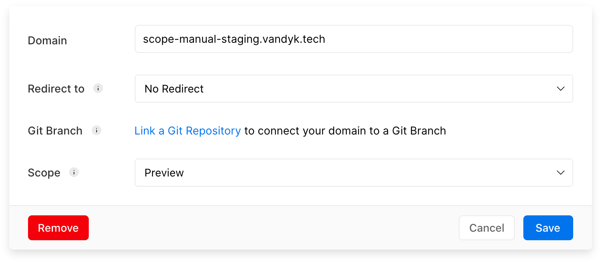

This is an example to show why a more advanced domain configuration inside one project will be better than forcing developers to use the Git integrations.

My believe is that a developer should be able to decide to have a more controlled deployment, To enable this they should between Git integration or to customise their deployment domains. (not both at the same time).

Currently [Vercel](https://vercel.com/docs/v2/git-integrations) only allows these customisation via the domains `Git Branch` configuration after setup up a git integration.

Why not enable another domain config, if the project has not been linked to a git branch, then the developer should be able to select the deployment scope for the domain. (Production | Preview | Unset)

> _note: if i talk about `Staging` it's equivalent to `Preview`_

A good example was when [Vercel](https://vercel.com/blog/automatic-aliasing) had the [`now --target staging`](https://vercel.com/blog/automatic-aliasing) command to trigger auto aliasing to your staging domains. Sadly that has been quickly deprecated.

> _and please dont tell me that this project can easily be setup with git integrations, **that i already know**, this project is just to serve as an example, we have many other more complex projects which can not currently follow a git intergration setup (hopefully in the future)_

So for my current solution each Project i have requires 2x Vercel Projects to cater for my Production environment and my Staging environment. That also means i need to separate all the Env Variables between projects and 2x the setup.

```bash
#production
> my-project

#staging | preview
> my-project-staging
```

<br />

# Current Workaround

I first have to run a landscape prepartion to setup the current `project id` in the `.now/project.json`

The landscape replaces the `__NOW_PROJECT_ID__` with the correct variable depending the the scope that i chose ( `production` | `staging` )

<br />

### Run a landscape prepartion

```bash
#production
yarn landscape production

#preview
yarn landscape staging
```

<br />

### Deploy to scope

```bash
#production
yarn release:prod

#preview
yarn release:staging
```

<br />

# Ideas of domain config

### Production

> 

### Preview

> 

### Unconfigured ( _defaults to production_ )

> 
