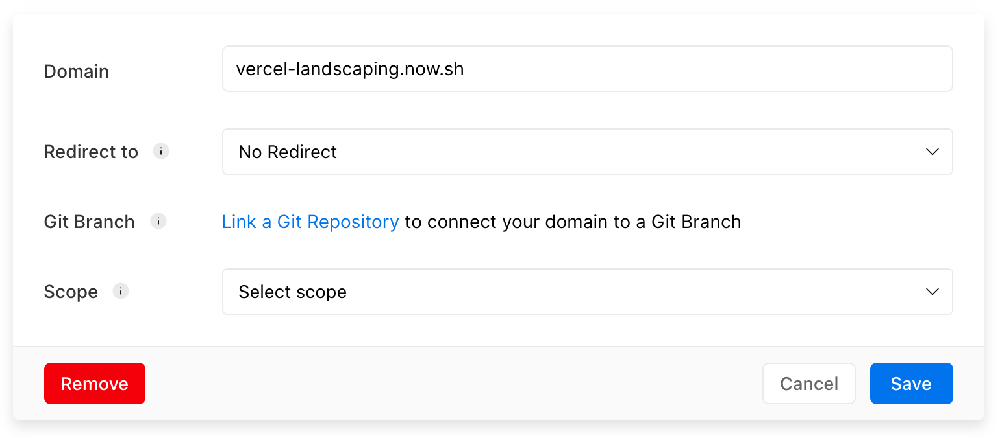

This is an example to show why a more advanced domain configuration inside one project will be better than forcing developers to use the Git integrations.

I believe that a developer should be able to decide to have a more controlled deployment, To enable this they should between Git integration or to customise their deployment domains. (not both at the same time).

Currently, Vercel only allows these customisations via the domains `Git Branch` configuration after setup up a git integration.

Why not enable another domain config, if the project has not been linked to a git branch, then the developer should be able to select the deployment scope for the domain. (Production | Preview | Unset)

> _note: if I talk about `Staging` it's refering to `Preview`_ 😋

<br />

A good example was when [Vercel](https://vercel.com/blog/automatic-aliasing) had the [`now --target staging`](https://vercel.com/blog/automatic-aliasing) command to trigger auto aliasing to your staging domains. Sadly that has been quickly deprecated.

> _and please don't tell me that this project can easily be set up with git integrations, **that I already know**, this project is just to serve as an example, we have many other more complex projects which can not currently follow a git integration setup (hopefully in the future it will)_

So for my current solution, each Project I have requires 2x Vercel Projects to cater for my Production environment and my Staging environment. That also means I need to separate all the Env Variables between projects and 2x the setup.

```bash
#production
> my-project

#staging | preview
> my-project-staging
```

<br />

# Current Workaround

I first have to run a landscape preparation to set up the current `project id` in the `.now/project.json`
The landscape replaces the `__NOW_PROJECT_ID__` with the correct variable depending on the scope that I chose ( `production` | `staging`

<br />

### Run a landscape prepartion

```bash
#production
yarn landscape production

#preview
yarn landscape staging
```

<br />

### Deploy to scope

```bash
#production
yarn release:prod

#preview
yarn release:staging
```

<br />

# Ideas of domain config

### Production


### Preview


### Unconfigured ( _defaults to production_ )


